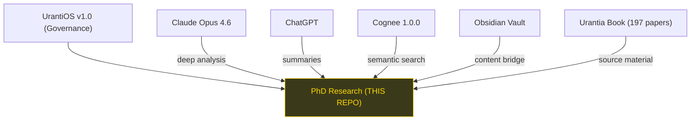
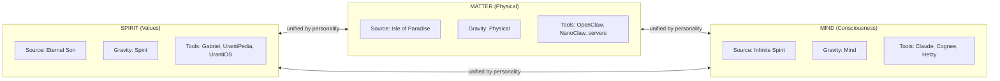

# Apps, Agents, Bots & Claws Catalog

> This is a cross-repo reference. The full catalog lives in **myedugit/mircea-constellation** on the `claude/visualize-apps-agents-fqhED` branch.
>
> **PhD Research (Triune Monism)** is tool #20 in the constellation — Status: LIVE.

See the full document at: `mircea-constellation/APPS_AGENTS_CATALOG.md`

## PhD Research Quick Reference

```
+--------------------------------------------+
|  PhD RESEARCH - TRIUNE MONISM              |
|  ==========================================|
|  Type: Service / Research                  |
|  Thesis: Three irreducible domains         |
|          (matter, mind, spirit)            |
|  Status: LIVE                              |
|  Repo: myedugit/phd-triune-monism         |
|  Tier: SERVICES                            |
|  Fleet Position: 20 of 25 tools            |
|                                            |
|  AI PARTNERS:                              |
|  +-- Claude (deep analysis, primary)       |
|  +-- ChatGPT (summaries, secondary)        |
|  +-- Cognee (semantic memory)              |
|                                            |
|  KEY FILES:                                |
|  +-- UrantiOS.md (full OS spec)            |
|  +-- CLAUDE.md (session instructions)      |
|  +-- TOE_DIARY.md (theory of everything)   |
|  +-- 00-10 numbered research folders       |
|                                            |
|  GRAVITY: Spirit (values/truth)            |
|  VALUES: Truth 5/5  Beauty 4/5             |
|          Goodness 5/5                      |
|  LUCIFER TEST: PASS                        |
+--------------------------------------------+
```

## Where PhD Research Fits



## Three Domains (The PhD Thesis Core)


