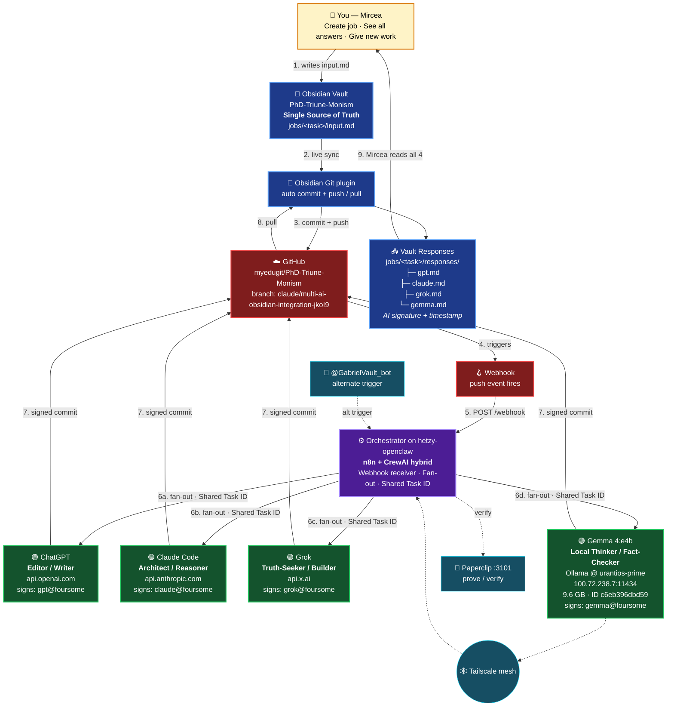

# Option D — The Awesome Foursome Architecture

> Vision: a job dropped into the vault wakes all four AIs automatically.
> "Reverse n8n" — the vault triggers the workflow, not the other way round.
> Each contribution signed with source AI name. All four share one Task ID.
> DRIFT → 4 working as one.

## Architecture diagram



## The Foursome — roles and endpoints

| AI | Role | Endpoint | Signature |
|---|---|---|---|
| **ChatGPT** | Editor / Writer | `api.openai.com` | `gpt@foursome` |
| **Claude Code** | Architect / Reasoner | `api.anthropic.com` | `claude@foursome` |
| **Grok** | Truth-Seeker / Builder | `api.x.ai` | `grok@foursome` |
| **Gemma 4:e4b** | Local Thinker / Fact-Checker | Ollama @ `urantios-prime` (`100.72.238.7:11434`) | `gemma@foursome` |

**Gemma 4 model selection.** Verified via `ollama list` on iMac_M4:

| Tag | Model ID | Size | Notes |
|---|---|---|---|
| `gemma4:e2b` | `7fbdbf8f5e45` | 7.2 GB | Smaller, faster |
| `gemma4:e4b` | `c6eb396dbd59` | 9.6 GB | **Foursome default** — balanced speed/capability |
| `gemma4:latest` | `c6eb396dbd59` | 9.6 GB | Alias of `e4b` |
| `gemma4:31b` | `6316f0629137` | 19 GB | Heavyweight — use for deep reasoning jobs only |

`gemma4:e4b` is the Foursome's Local Thinker. For jobs requiring deeper reasoning, the orchestrator can route to `gemma4:31b` instead via a job-level flag in `input.md` frontmatter (`gemma_model: gemma4:31b`).

## Vault convention

```
PhD-Triune-Monism/
└── jobs/
    └── <task-name>/
        ├── input.md                    # the job spec — Mircea writes this
        └── responses/
            ├── gpt.md                  # ChatGPT's signed reply
            ├── claude.md               # Claude's signed reply
            ├── grok.md                 # Grok's signed reply
            └── gemma.md                # Gemma 4:e4b's signed reply
```

Each response file carries AI signature + ISO timestamp in its frontmatter.

## The 9-step hot path

1. **You write** `jobs/<task>/input.md` in Obsidian
2. **Obsidian Git** live-syncs the change
3. **Commit + push** to GitHub
4. GitHub **webhook** fires on push
5. **n8n** receives `POST /webhook` on `hetzy-openclaw:5678`
6. n8n **fans out** with a Shared Task ID → (a) GPT, (b) Claude, (c) Grok, (d) Gemma in parallel
7. Each AI writes its reply as a **signed commit** back to GitHub
8. Obsidian Git **pulls** the four new files
9. **You read** all four answers side-by-side in Obsidian

## Support layer (not on the hot path, but essential)

- **Tailscale mesh** — how n8n reaches Gemma on `urantios-prime`
- **Paperclip** (`:3101/paperclip/prove`) — receipt / verification service
- **@GabrielVault_bot** — Telegram alternate trigger for jobs from mobile

## Cost

Real verified spend: **$33.29/mo** to Hetzner Online GmbH (PayPal, 14 Apr 2026).
Plus per-call API usage for OpenAI / Anthropic / xAI. Gemma is free (local).

## Render this diagram

- **Obsidian**: renders natively in Preview mode
- **Web**: paste into https://mermaid.live → export PNG/SVG
- **CLI**: `npm i -g @mermaid-js/mermaid-cli && mmdc -i option-d-foursome.md -o option-d-foursome.svg`
